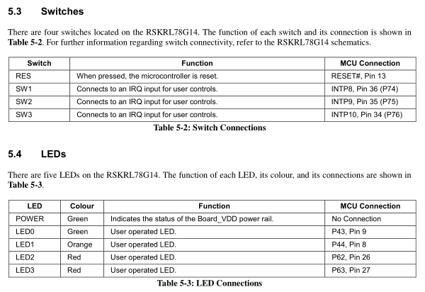
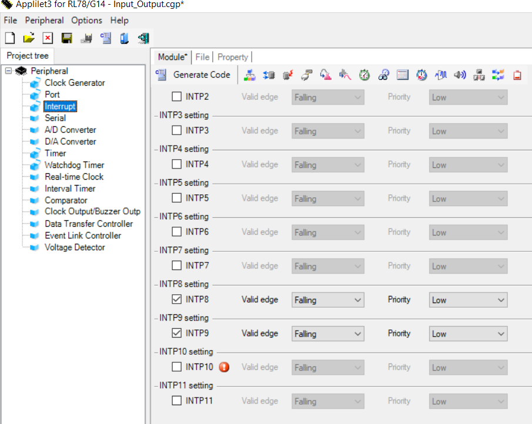
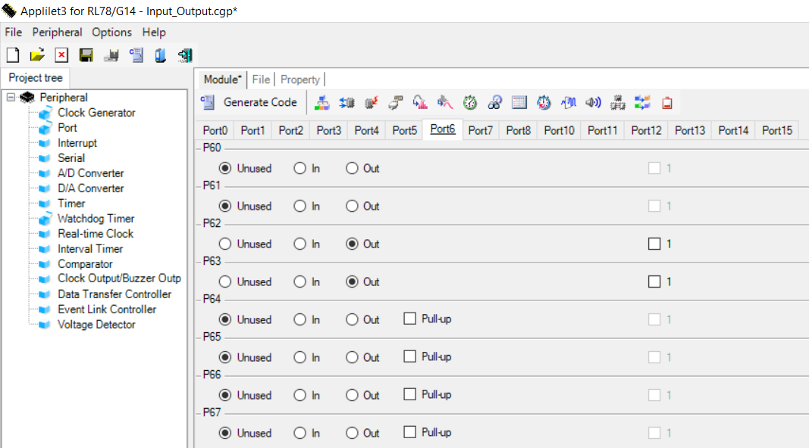
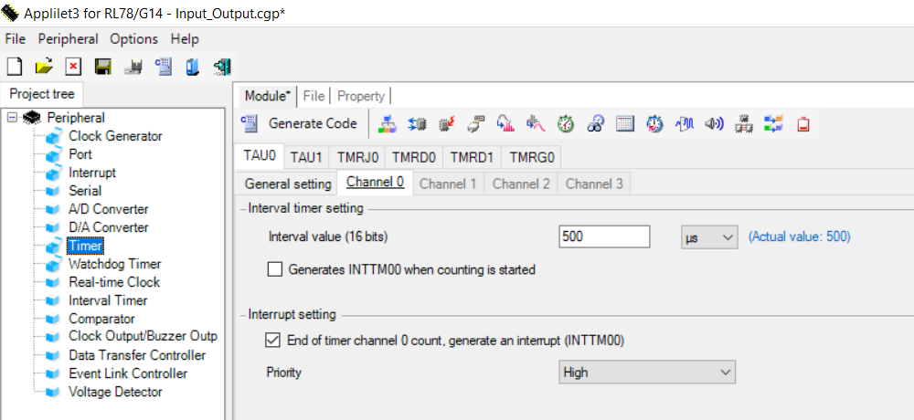

# Input Output RL78/G14-R5F104PJA (RSKRL78G14 Development board)

Whenever the embedded  system engineer has experience with a special microcontroller, when he starts using a new microcontroller,
he needs to start with the input and output pins, the first example that starts to be used is the LED tilting.

This example gives you a simple overview of the use of input, output, and external interrupt.
In this example I used 3 outputs and 3 inputs with 2 as the external interrupt, and a timer for 500us used to activate the flgs which I used it to manage my example like generating a dely.

# Tools used  
1. Applilet3 for RL78 version 3.02 used to configure the project is a code generator.
2. IAR Embedded Worckbench for Renesas RL78 version4.21.1
3. RSKRL78G14 Development board with RL78/G14-R5F104PJA microcontroller 
4. Renesas E1 programmer 

# How this exampel works 
- One of the LEDs, LED3 stay blinking each 500ms.
- when switch 3 is pressed, LED2 turns ON otherwise it goes OFF.
- when switch 1 is pressed, the LED0 and LED1 will blinking and turned OFF.

# Example Configuration
- Renesas(RSKRL78G14) Starter Kit User’s Manual page 17.

 

 - Applilet configuration

 Input configuration pin (switch3)

Input external interrupt (switch2 and switch1)

Output configuration

Timer configuration

